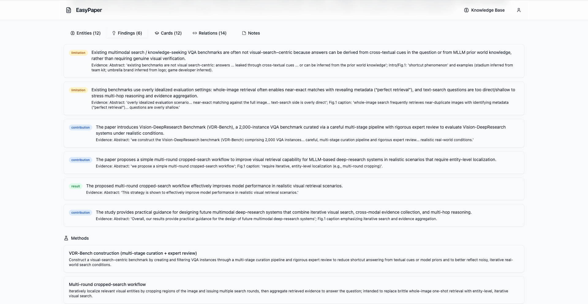
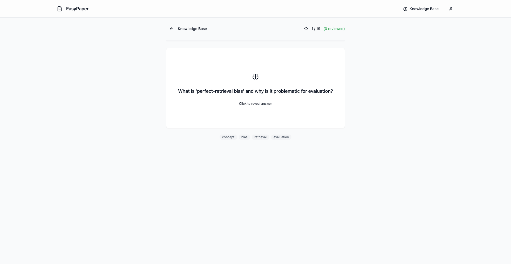

[English](README.md) | [简体中文](README_zh.md) | [繁體中文](README_tw.md) | [日本語](README_jp.md)

# EasyPaper

**Turn academic papers into knowledge you keep.**

🌐 **Live Demo:** [https://easypaper.aws.xin](https://easypaper.aws.xin) (Test account: `neo@test.com` / `test123456`)

### 🐳 Docker Quick Start

```bash
git clone https://github.com/neosun100/EasyPaper.git
cd EasyPaper
cp backend/config/config.example.yaml backend/config/config.yaml
# Edit config.yaml — add your API key and choose your model
docker compose up --build
```

Open http://localhost:9201 in your browser. That's it!

---

EasyPaper is a self-hosted web app that helps you read, understand, and retain knowledge from English academic papers. Upload a PDF — get back a translated or simplified version with layout intact, AI-highlighted key sentences, and a portable knowledge base you can export anywhere.

---

## What It Does

### 1. Translate & Simplify

- **English → Chinese** translation preserving layout, images, and formulas (powered by [pdf2zh](https://github.com/Byaidu/PDFMathTranslate))
- **English → Simple English** vocabulary simplification (CEFR A2/B1, ~2000 common words)
- PDF-in, PDF-out — figures, equations, and formatting stay intact

### 2. AI Highlighting

Automatically identifies and color-codes key sentences in the processed PDF:

| Color | Category | What It Highlights |
|-------|----------|-------------------|
| Yellow | Core Conclusions | Main findings and research outcomes |
| Blue | Method Innovations | Novel approaches and technical contributions |
| Green | Key Data | Quantitative results, metrics, experimental data |


### 3. Knowledge Base (Portable)

Extract structured knowledge from papers via LLM — stored as portable JSON, never locked to this app:

- **Entities**: methods, models, datasets, metrics, concepts, tasks, people, organizations
- **Relationships**: extends, uses, evaluates_on, outperforms, similar_to, contradicts, part_of, requires
- **Findings**: results, limitations, contributions with evidence references
- **Flashcards**: auto-generated study cards with SM-2 spaced repetition scheduling




### 4. Knowledge Graph

Interactive force-directed graph visualization of entities and relationships across all your papers. Color-coded by entity type, sized by importance, with search and zoom.

### 5. Multi-Format Export

Your knowledge is yours. Export it in any format:

| Format | Extension | Use Case |
|--------|-----------|----------|
| EasyPaper JSON | `.epaper.json` | Complete portable knowledge (primary format) |
| Obsidian Vault | `.zip` | Markdown notes with wikilinks for Obsidian |
| BibTeX | `.bib` | LaTeX citation management |
| CSL-JSON | `.json` | Zotero / Mendeley compatible |
| CSV | `.zip` | Spreadsheet analysis (entities + relationships) |

### 6. Flashcard Review

Built-in spaced repetition system (SM-2 algorithm) for reviewing auto-generated flashcards. Rate your recall from 0-5, and the system schedules optimal review intervals.



---

## Screenshots

### Translate to Chinese


### Simplify English


### Layout-Preserving Technology


---

## Quick Start

### Option 1: Docker (Recommended)

```bash
cp backend/config/config.example.yaml backend/config/config.yaml
# Edit config.yaml — add your API key and choose your model

docker compose up --build
```

Open http://localhost in your browser.

### Option 2: Local Development

**Prerequisites:** Python 3.10+, Node.js 18+, an OpenAI-compatible LLM API key

**Backend:**

```bash
cd backend
python -m venv .venv
source .venv/bin/activate
pip install -r requirements.txt

cp config/config.example.yaml config/config.yaml
# Edit config.yaml — add your API key

uvicorn app.main:app --reload
```

**Frontend:**

```bash
cd frontend
npm install
npm run dev
```

Open http://localhost:5173.

---

## Configuration

Edit `backend/config/config.yaml`:

```yaml
llm:
  api_key: "YOUR_API_KEY"             # Required — any OpenAI-compatible API
  base_url: "https://api.example.com/v1"
  model: "gemini-2.5-flash"           # Model for translation/simplification/extraction
  judge_model: "gemini-2.5-flash"

processing:
  max_pages: 100
  max_upload_mb: 50
  max_concurrent: 3                   # Concurrent processing tasks

storage:
  cleanup_minutes: 30                 # TTL for temporary files
  temp_dir: "./backend/tmp"

database:
  url: "sqlite:///./data/app.db"

security:
  secret_key: "CHANGE_THIS"           # JWT signing key — must change in production
  cors_origins:
    - "http://localhost:5173"
```

---

## Tech Stack

| Component | Technology |
|-----------|------------|
| Backend | FastAPI, PyMuPDF, pdf2zh (PDFMathTranslate), httpx |
| Frontend | React 18, TypeScript, Vite, Tailwind CSS, Radix UI |
| Database | SQLite via SQLModel |
| Auth | JWT (python-jose), bcrypt, OAuth2 bearer |
| AI/LLM | Any OpenAI-compatible API (configurable) |
| DevOps | Docker Compose, GitHub Actions, ruff, ESLint |

---

## API Overview

| Endpoint | Description |
|----------|-------------|
| `POST /api/upload` | Upload PDF (translate/simplify, optional highlight) |
| `GET /api/status/{id}` | Processing status & progress |
| `GET /api/result/{id}/pdf` | Download processed PDF |
| `POST /api/knowledge/extract/{id}` | Trigger knowledge extraction |
| `GET /api/knowledge/papers` | List knowledge base papers |
| `GET /api/knowledge/graph` | Knowledge graph (entities + relationships) |
| `GET /api/knowledge/flashcards/due` | Due flashcards for review |
| `POST /api/knowledge/flashcards/{id}/review` | Submit review result |
| `GET /api/knowledge/export/json` | Export full knowledge base |
| `GET /api/knowledge/export/obsidian` | Export as Obsidian vault |
| `GET /api/knowledge/export/bibtex` | Export as BibTeX |

---

## Development

```bash
# Backend
cd backend
ruff check app/
pytest

# Frontend
cd frontend
npm run lint
npm run type-check
npm test
```

---

## License

MIT
