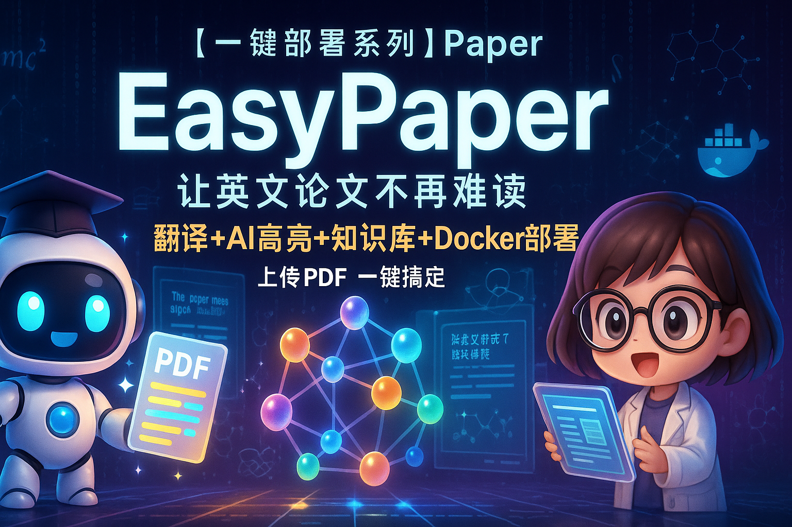
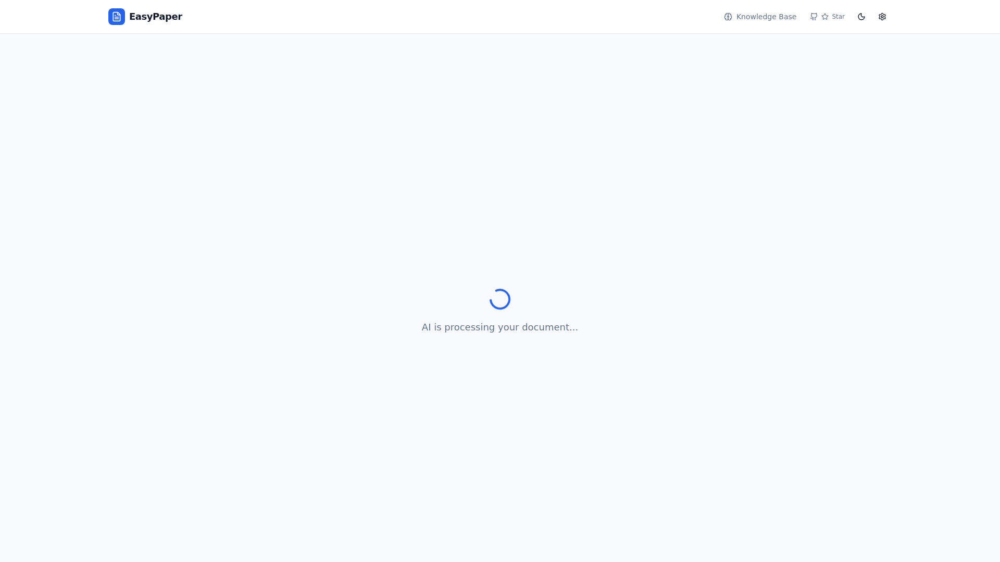
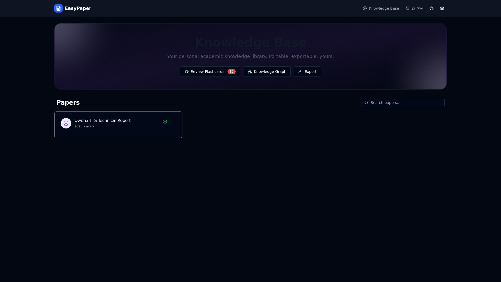
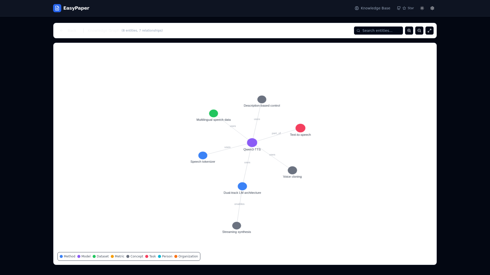
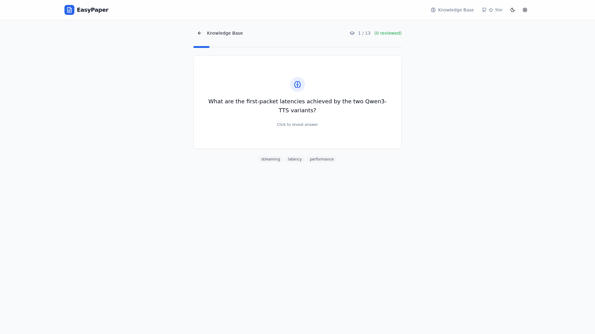
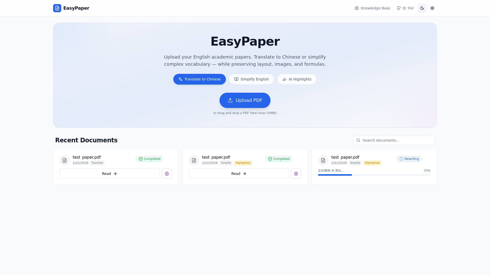
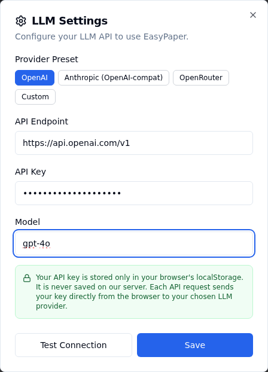

[English](README.md) | [简体中文](README_zh.md) | [繁體中文](README_tw.md) | [日本語](README_jp.md)

<p align="center">
  
</p>

<h1 align="center">EasyPaper</h1>

<p align="center">
  <strong>把论文变成带得走的知识。</strong>
</p>

<p align="center">
  <a href="https://github.com/neosun100/EasyPaper/stargazers"></a>
  <a href="https://github.com/neosun100/EasyPaper/blob/main/LICENSE"></a>
  <a href="https://github.com/neosun100/EasyPaper/actions"></a>
</p>

---

EasyPaper 是一个**自托管**的 Web 应用，帮助你阅读、理解和记忆英文学术论文中的知识。上传一篇 PDF，即可获得保留原始排版的翻译/简化版本、AI 自动高亮的关键语句，以及可导出到任何地方的便携式知识库。

> **BYOK（自带密钥）** — 所有 LLM 凭证仅存储在浏览器的 localStorage 中，服务器不会保存你的 API 密钥。

## ✨ 功能特性

### 📖 翻译 & 简化

将英文论文翻译为中文，或简化为通俗英语（CEFR A2/B1），保留排版、图片和公式。基于 [pdf2zh](https://github.com/Byaidu/PDFMathTranslate)。

<p align="center">
  
</p>

### 🎨 AI 高亮

自动识别并用颜色标注 PDF 中的关键语句：

| 颜色 | 类别 | 高亮内容 |
|------|------|---------|
| 🟡 黄色 | 核心结论 | 主要发现和研究成果 |
| 🔵 蓝色 | 方法创新 | 新颖方法和技术贡献 |
| 🟢 绿色 | 关键数据 | 定量结果、指标、实验数据 |

### 🧠 知识库

通过 LLM 从论文中提取结构化知识 — 实体、关系、发现和闪卡 — 以可移植的 JSON 格式存储。

<p align="center">
  
</p>

<p align="center">
  
</p>

### 🕸️ 知识图谱

交互式力导向图，可视化所有论文中的实体和关系。

<p align="center">
  
</p>

### 🃏 闪卡复习

内置间隔重复算法（SM-2），用于复习自动生成的闪卡。

<p align="center">
  
</p>

### 📦 多格式导出

| 格式 | 用途 |
|------|------|
| EasyPaper JSON | 完整的可移植知识（主要格式） |
| Obsidian Vault | 带 wikilinks 的 Markdown 笔记 |
| BibTeX | LaTeX 引用管理 |
| CSL-JSON | Zotero / Mendeley 兼容 |
| CSV | 电子表格分析 |

### 🌙 深色模式

全界面深色模式支持。

<p align="center">
  
</p>

---

## 🚀 快速开始

### Docker（推荐）

```bash
git clone https://github.com/neosun100/EasyPaper.git
cd EasyPaper
docker compose up --build
```

打开 **http://localhost:9201**，在设置中配置 LLM API 密钥，即可开始上传论文。

<p align="center">
  
</p>

### 本地开发

**前置条件：** Python 3.10+、Node.js 18+、OpenAI 兼容的 LLM API 密钥

**后端：**

```bash
cd backend
python -m venv .venv && source .venv/bin/activate
pip install -r requirements.txt
uvicorn app.main:app --reload
```

**前端：**

```bash
cd frontend
npm install && npm run dev
```

打开 **http://localhost:5173**。

---

## 🏗️ 技术栈

| 组件 | 技术 |
|------|------|
| 后端 | FastAPI, Python 3.11, pdf2zh, PyMuPDF, httpx |
| 前端 | React 18, TypeScript, Vite, Tailwind CSS, shadcn/ui |
| 数据库 | SQLite via SQLModel |
| AI/LLM | 任何 OpenAI 兼容 API（BYOK） |
| 基础设施 | Docker Compose, nginx, GitHub Actions CI |

---

## 🙏 致谢

本项目 fork 自 [CzsGit/EasyPaper](https://github.com/CzsGit/EasyPaper)。感谢原作者的基础工作。我们在此基础上进行了 UI/UX 改进、深色模式修复、文档增强及其他优化。

---

## 📄 许可证

MIT
